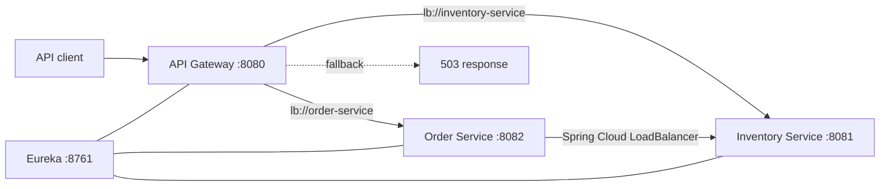

# Spring Cloud Platform Lab

A compact, runnable reference platform that demonstrates service discovery, edge routing, client-side load balancing, circuit-breaker fallbacks, and operational endpoints without carrying client or employer code into a public portfolio.

## Architecture



| Module | Responsibility | Portfolio signal |
| --- | --- | --- |
| `discovery-server` | Eureka registry | Service discovery and health-aware topology |
| `api-gateway` | Routes `/api/*` traffic through discovered service IDs | Reactive gateway, load balancing, circuit breaking |
| `inventory-service` | Small deterministic inventory API | Independently deployable service and metrics |
| `order-service` | Builds a quote using discovered inventory | Synchronous service-to-service communication and failure semantics |

## Run it

Requirements: Java 17 and Maven 3.9+, or Docker with Compose.

```bash
mvn --batch-mode --no-transfer-progress verify
docker compose up --build
./scripts/smoke-test.sh
```

Useful endpoints:

- Eureka dashboard: `http://localhost:8761`
- Gateway health: `http://localhost:8080/actuator/health`
- Inventory through the gateway: `GET http://localhost:8080/api/inventory/items/sku-123`
- Quote through the gateway:

```bash
curl --request POST \
  --header 'Content-Type: application/json' \
  --data '{"sku":"sku-123","quantity":2}' \
  http://localhost:8080/api/orders/quote
```

## Design decisions

- **One platform repository, not four toy repositories.** The modules are only meaningful together and share a single reproducible build.
- **Clean-room implementation.** Names, code, data, configuration, and history were newly authored for this repository. Older work supplied only general architectural experience.
- **Explicit routes.** The gateway exposes a deliberate public surface instead of enabling automatic routes for every registered service.
- **Deterministic data.** The sample domain stays in memory so the repository focuses on platform concerns rather than database setup.
- **Operational visibility.** Each runtime exposes health probes; application services and the gateway export Prometheus metrics.
- **Non-root containers.** Runtime images execute as a dedicated unprivileged user.

## Failure behavior

Gateway routes use Resilience4j-backed circuit breakers. If a downstream service is unavailable, the edge returns an explicit `503` fallback body. The order service distinguishes an unavailable inventory dependency (`503`), an unknown SKU (`404`), insufficient stock (`409`), and invalid input (`400`).

This is an educational reference implementation, not a claim of production deployment. A production system would add authentication and authorization, distributed tracing, persistent data, rate limiting, container health-gated startup, and environment-specific secret management.

## Technology baseline

- Java 17
- Spring Boot 4.1.0
- Spring Cloud 2025.1.2
- Spring Cloud Gateway Server WebFlux
- Netflix Eureka
- Spring Cloud LoadBalancer
- Resilience4j
- Micrometer with Prometheus registry

## License

[MIT](LICENSE)
